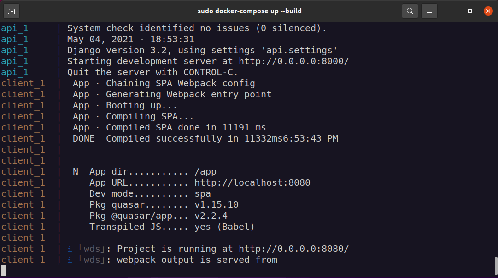
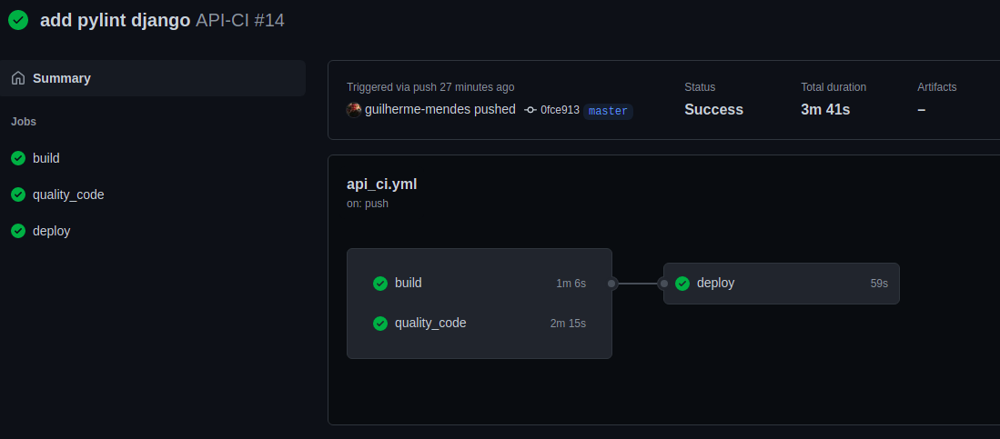
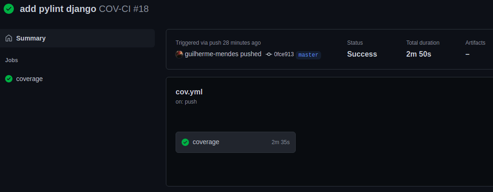

# Trabalho Individual 2020.2

[](https://github.com/guilherme-mendes/Trabalho-Individual-2020-2/actions/workflows/api_ci.yml)
[](https://sonarcloud.io/dashboard?id=guilherme-mendes_Trabalho-Individual-2020-2_api)
[](https://sonarcloud.io/dashboard?id=guilherme-mendes_Trabalho-Individual-2020-2_api)
[](https://codeclimate.com/github/guilherme-mendes/Trabalho-Individual-2020-2/maintainability)
[](https://codecov.io/gh/guilherme-mendes/Trabalho-Individual-2020-2)
<br>
[](https://github.com/guilherme-mendes/Trabalho-Individual-2020-2/actions/workflows/client_ci.yml)
[](https://sonarcloud.io/dashboard?id=guilherme-mendes_Trabalho-Individual-2020-2_client)
[](https://sonarcloud.io/dashboard?id=guilherme-mendes_Trabalho-Individual-2020-2_client)


| Aluno | Matrícula |
| --- | --- |
| Guilherme Mendes Pereira | 17/0129411 |


### 1. Containerização

A containerização de toda aplicação se deu a partir dos três Dockerfiles do backend, frontend e banco de dados:
* [Dockerfile api](./api/Django.Dockerfile)
* [Dockerfile client](./client/Dockerfile)
* [Dockerfile postgress](./api/db/Postgresql.Dockerfile)

Já a orquestração dos containers foi feita utilizando o docker-compose, com a configuração descrita no arquivo [docker-compose.yaml](./docker-compose.yaml)

Comando para execução da aplicação:
```
docker-compose up --build
```

O resuldado do comando deve ser o seguinte:



Após a build, o app pode ser acessado no `localhost:8080/`.

### 2. Integração contínua, Coverage e Deploy Contínuo

A integração contínua foi feita utilizando o GitHub Actions e foram criados três workflows:
* [API-CI](./.github/workflows/api_ci.yml)



* Build
* Code quality<br>
[SonarCloud](https://sonarcloud.io/dashboard?id=guilherme-mendes_Trabalho-Individual-2020-2_api)<br>
[CodeClimate](https://codeclimate.com/github/guilherme-mendes/Trabalho-Individual-2020-2)<br>
[CodeCov](https://app.codecov.io/gh/guilherme-mendes/Trabalho-Individual-2020-2)<br>
[Pylint](https://github.com/guilherme-mendes/Trabalho-Individual-2020-2/runs/2503225056?check_suite_focus=true)

* Deploy<br>
[DockerHub](https://hub.docker.com/repository/docker/guilhermemp/gces-trabalho-individual-2020-2)

Comando para execução do deploy da imagem no DockerHub:
```
docker push guilhermemp/gces-trabalho-individual-2020-2:tagname
```

* [CLIENT-CI](./.github/workflows/client_ci.yml)


* Build

* Code quality<br>
[SonarCloud](https://sonarcloud.io/dashboard?id=guilherme-mendes_Trabalho-Individual-2020-2_client)<br>
[CodeClimate](https://sonarcloud.io/dashboard?id=guilherme-mendes_Trabalho-Individual-2020-2_client)<br>

* [COV-CI](./.github/workflows/cov.yml)



* Coverage 97% <br>
[CodeCov](https://app.codecov.io/gh/guilherme-mendes/Trabalho-Individual-2020-2)<br>
